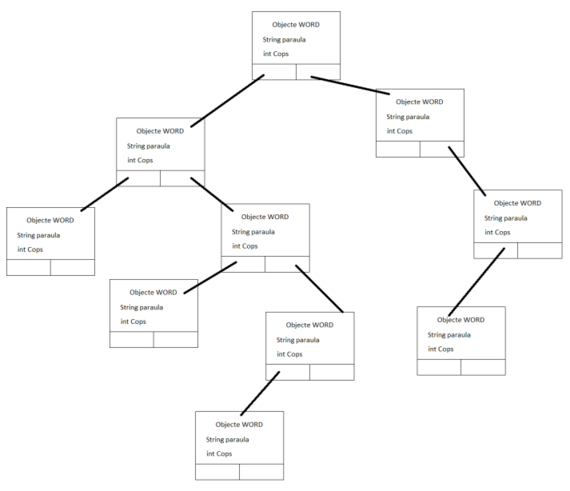

# WordCount

This project, aims to develop and study the performance of an algorithm capable of measuring the frequency of appearances of words in each text. The development, supported by a development methodology (analysis, design, implementation and testing), it includes the design of different counting modes with the application of data structures to achieve the intended purpose.

## Interface

The interface is quite simple, it includes four different options to choose from:
* Select input file
* Calculate the frequency of appearance of words
* Visualize results
* Exit

## Data structures

The project requirement, was to study and developed four different data structures to accomplish the given task. We choose the following ones to compare to each other.

### Binary and AVL trees

The following image illustrates how we organized each node of both trees. (This example is form the binary tree).
Each node has:
* Word
* Number of times the word has shown up
* Connection to each of its child nodes

### Hash Table

When designing a hash table, you have to take into consideration a lot more than, for instance, a AVL tree. Because, the selected hash function or collision resolution changes dramatically the performance from one application to another. 

In our case, we decided to choose a the [Open Addressing](https://en.wikipedia.org/wiki/Open_addressing) method, for collision resolution with the linear probing (Other probe sequences may be better, but we saw that this one worked just fine, with our load factor). 

In another hand, in order to select the best possible hash function, we did some testing with our structure and figure out, which one give the best performance.

As the figure shows, we decided to use the JSHash function, as it give us, the lowest ms together with a lower number of collisions.

### Hash Table and AVL

Finally, we decided to implement a hybrid structure that was a combination of a Hash table and AVL tree. 

From one hand, searching the nodes that were in the same index of the hash function, would be O(log n) instead of O(n). Together with a well-balanced hash table, that would give us a lower number of collisions, so a faster search overall. 

Besides that, and because of the limited time we had, the hash table is not well balanced. Having a length of 26, makes it almost useless, because the number of collisions are extremely high. So, I consider this project **still in development**.

Having said that, we did some testing, so here are the results:

#### Memory Usage

The structure with the higher memory usage, as expected, is the Hash table plus AVL. As having these two structures together, without a proper fusion, creates unused memory with variables, etc.

In the other end, the binary tree, as it has the simplest logic, the memory usage is the lowest of the four.

#### Execution time

Having in consideration the fact that the hybrid structure is not well implemented, we found out that, the tree logic has some sort of handicap. The difference between each structure is not normal, so there is still some work to do in order to improve it.  

